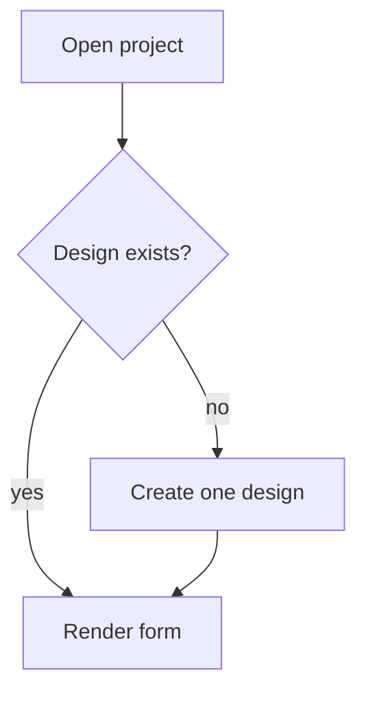

# Make PR

Goal: a reviewer reads the first 5 lines and knows what changed and why.

## Steps

1. Read the diff, `.github/pull_request_template.md` (it changes), and the PR if one exists:
   ```bash
   git diff main...HEAD --stat | tail -30
   gh pr view --json number,title,body,url
   ```

2. Write the body to a temp file: the template **verbatim**, with `## Description` filled
   using the layout below. For an existing PR, keep every other section and the
   `Resolves <TICKET-ID>` line exactly as they are in its body. Save screenshots outside the
   repo so `git add` skips them, and link each by its path,
   ``, numbered in the order a user sees them,
   in the template's screenshots section or under the Description if it has none.

3. Commit, push, and create or update the PR with one `--attach` per screenshot. `gh`
   (2.99 or newer) uploads each file and swaps its path in the body for the uploaded URL.
   Uploads can't be deleted, so attach only the final screenshots.
   ```bash
   git add -A && git commit -m "<type>(<scope>): <imperative summary>"
   git push -u origin HEAD
   gh pr create --title "<type>(<scope>): <imperative summary>" --body-file <tmpfile> \
     --label preview:web --attach /tmp/pr-screenshots/1-<slug>.png
   # existing PR:
   gh pr edit <number> --body-file <tmpfile> --attach /tmp/pr-screenshots/1-<slug>.png
   ```

4. Report the PR URL and the one-line summary you wrote. Nothing else — when
   another skill called you, it writes the final message.

## Description layout

```markdown
**In one line:** <what a user notices now, plain language>

**The problem:** <1-2 short sentences>
**The fix:** <1-2 short sentences>

| Before | After |
| --- | --- |
| <old behaviour> | <new behaviour> |

<mermaid diagram — only when flow or state order is the point>

**The rule in code** — only when a business rule is easier to read than to describe
```ts
// path/to/file.ts — <the requirement this encodes>
<3-10 lines, copied from the diff>
```

**Files that matter**
- `path/to/file.ts` — <what it now does>
```

Drop any block that adds nothing. Two good lines beat five filler ones.

## Rules

- **Simple technical English.** Short sentences. Names of things stay (`useQuery`,
  `cooling_designs`); explain the rest. No "leverage", "robust", "seamlessly".
- **Visual first.** A table or a mermaid diagram instead of a paragraph, whenever it fits.
  Mermaid renders natively on GitHub — use ```` ```mermaid ```` fences, `flowchart TD` or
  `sequenceDiagram`, max ~8 nodes, plain labels with no special characters.
- **One snippet, at most.** Add the code block only when the change turns on a business
  requirement — a threshold, a formula, a country-specific rule, an ordering constraint —
  that a reviewer would otherwise have to open the diff to check. Copy it verbatim from the
  diff (elide the middle with `// …`), keep it under 10 lines, and put the requirement in a
  comment on the first line. Never paste plumbing, boilerplate, or a whole function.
- **Under ~200 words** in the Description section, snippet excluded.
- **No new claims.** Describe only what the diff does. No invented testing, metrics, or tickets.
- **Do not touch** the title, labels, checklist ticks, or the Linear `Resolves` line —
  unless the user asks.
- Screenshots stay if they are already there.

## Example Description

````markdown
**In one line:** Opening a cooling load project no longer hangs on the loading spinner.

**The problem:** The page created a cooling design, then re-ran the same effect, which
created another one. The list never settled, so the spinner never stopped.
**The fix:** Create the design once per project and wait for the write to land before
rendering.

| Before | After |
| --- | --- |
| Endless spinner, duplicate designs in the DB | Page opens, one design per project |



**The rule in code**
```ts
// useCoolingDesign.ts — one cooling design per project, so the list can settle
if (designs.some((d) => d.projectId === projectId)) return
await createCoolingDesign({ projectId })
```

**Files that matter**
- `apps/web/src/features/cooling/useCoolingDesign.ts` — guards the create call
````
