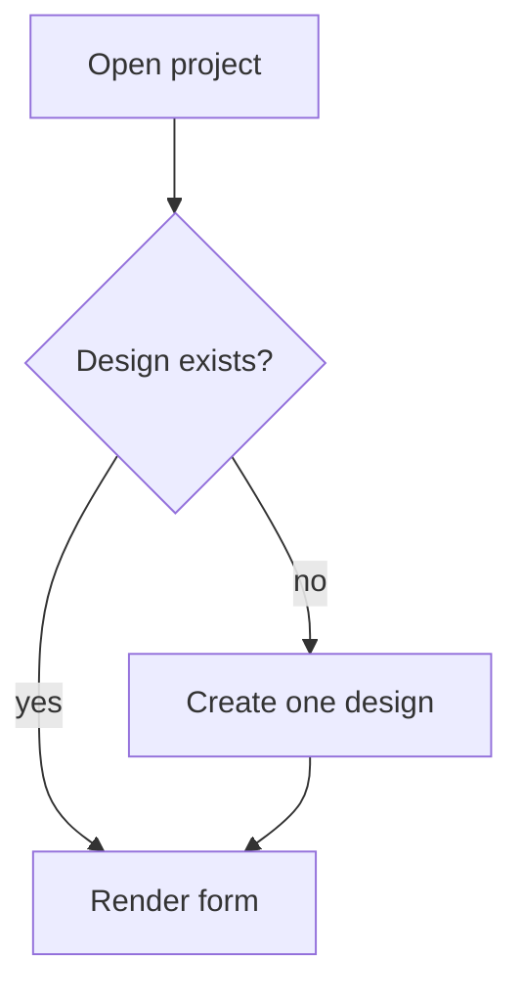

# PR Simple

Goal: a reviewer reads the first 5 lines and knows what changed and why.

## Steps

1. Read the current PR and the diff:
   ```bash
   gh pr view --json number,title,body,url
   git diff main...HEAD --stat | tail -30
   ```
   No PR yet? Say so and stop. Do not create one.

2. Read `.github/pull_request_template.md` from disk (it changes).

3. Write the new body to a temp file: the template **verbatim**, with the `## Description`
   section filled using the layout below. Keep every other section and the
   `Resolves <TICKET-ID>` line exactly as they already are in the PR body.

4. Push it:
   ```bash
   gh pr edit <number> --body-file <tmpfile>
   ```

5. Print the PR URL and the one-line summary you wrote. Nothing else.

## Description layout

```markdown
**In one line:** <what a user notices now, plain language>

**The problem:** <1-2 short sentences>
**The fix:** <1-2 short sentences>

| Before | After |
| --- | --- |
| <old behaviour> | <new behaviour> |

<mermaid diagram — only when flow or state order is the point>

**Files that matter**
- `path/to/file.ts` — <what it now does>
```

Drop any block that adds nothing. Two good lines beat five filler ones.

## Rules

- **Simple technical English.** Short sentences. Names of things stay (`useQuery`,
  `cooling_designs`); explain the rest. No "leverage", "robust", "seamlessly".
- **Visual first.** A table or a mermaid diagram instead of a paragraph, whenever it fits.
  Mermaid renders natively on GitHub — use ```` ```mermaid ```` fences, `flowchart TD` or
  `sequenceDiagram`, max ~8 nodes, plain labels with no special characters.
- **Under ~200 words** in the Description section.
- **No new claims.** Describe only what the diff does. No invented testing, metrics, or tickets.
- **Do not touch** the title, labels, checklist ticks, or the Linear `Resolves` line —
  unless the user asks.
- Screenshots stay if they are already there.

## Example Description

````markdown
**In one line:** Opening a cooling load project no longer hangs on the loading spinner.

**The problem:** The page created a cooling design, then re-ran the same effect, which
created another one. The list never settled, so the spinner never stopped.
**The fix:** Create the design once per project and wait for the write to land before
rendering.

| Before | After |
| --- | --- |
| Endless spinner, duplicate designs in the DB | Page opens, one design per project |



**Files that matter**
- `apps/web/src/features/cooling/useCoolingDesign.ts` — guards the create call
````
